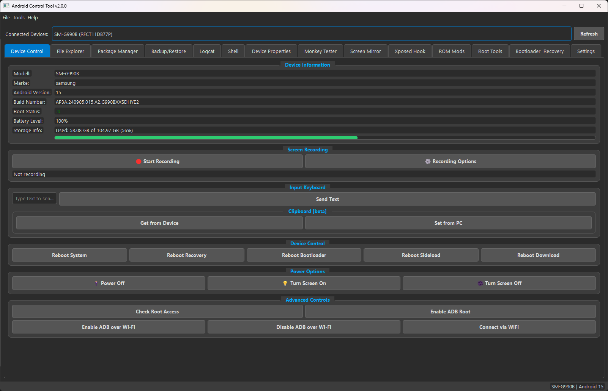
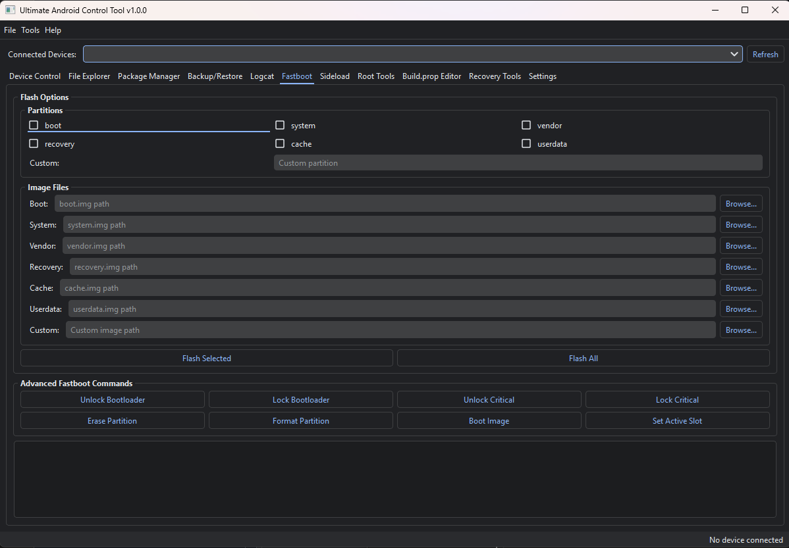
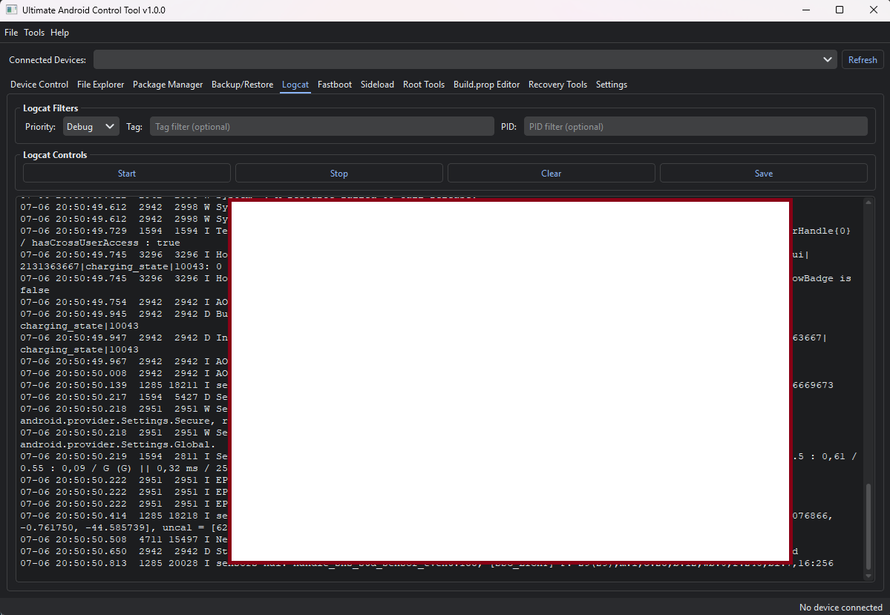

# Android Control Tool V2 (ACT)

A powerful Python GUI tool to manage and control Android devices via ADB and Fastboot.

### 💥MEGA UPDATE V2.0.0💥

## 📸 Screenshot





# 📦 Changelog

All notable changes to **Android Control Tool** will be documented in this file.  
This project adheres to **Semantic Versioning (SemVer)**.

---

## [2.0.0] - 2025-10-27  
### 💥 Major Release — MEGA UPDATE

This update represents a **near-complete backend rewrite** and a **major feature expansion**, moving from **v1.0.1 → v2.0.0**.  
Focus areas: **stability, performance, usability, and developer productivity.**

---

### ✨ New Features

#### 🧩 Major New Tabs & Tools
- **Screen Mirroring** – integrates `scrcpy` for low-latency mirroring.  
  → Automatically downloads and sets up scrcpy if missing.
- **Advanced Shell** – interactive ADB shell with history and Quick Commands  
  (battery, memory, process list, etc.).
- **Device Properties Explorer** – categorized and searchable view of all `getprop` system properties.  
  → Supports export.
- **Monkey Tester** – graphical interface for running `adb shell monkey` stress tests.
- **ROM Modifications** *(root required)*  
  - Custom boot animations & fonts  
  - Change screen DPI  
  - Apply ad-blocking hosts file  
  - Toggle SELinux & navigation bar  
  - Adjust animation scales & private DNS
- **Bootloader & Recovery** – unified tab replacing Fastboot/Recovery.  
  → Streamlined flashing, wiping, and Magisk-patched boot flashing.

#### 🧩 Minor Additions
- **Screen Recording** (custom resolution, bitrate, duration).  
- **Clipboard Management** (get/set device clipboard).  
- **Text Input** (send text to device fields).  
- **APK Analysis** (via `aapt` – view permissions, app name, version).  
- **Automatic Tool Setup** (ADB, Fastboot, scrcpy auto-download).

---

### 🚀 Improvements & Refactoring

#### ⚙️ Core Architecture
- Backend rewritten to use **QProcess + async command queue** instead of `subprocess`.  
- Dramatically improves **responsiveness and stability**.

#### 🔍 Device Detection
- Fully asynchronous device scanning (no UI freeze).  
- Displays **device model names** for easier identification.

#### 🪵 Error Handling & Logging
- Global exception handler for all unhandled errors.  
- All logs written to:


## 🧩 Features [v1.0.0]

- Device detection (ADB / Fastboot)
- Reboot options (System, Recovery, Bootloader, Download)
- File Explorer (local ↔ device)
- APK installation and app management
- Logcat viewer
- Root Management
- Backup and restore
- ADB over WiFi
- Flash via Fastboot
- Install zip via Sideload
- Root Tools/Management
- Build.prop Viewer/Editor (need to update)

## 🖼️ Built with

- PyQt6

## 🧪 Supported Android Versions

Android 4.0 to 16+

## 🚀 Installation

1. Make sure `adb` and `fastboot` are available in your system PATH.
2. Install Python 3.11 (3.9+)
3. Install dependencies:

```bash
pip install -r requirements.txt
```

4. Run UACT:

```bash
python main.py
```
# # Knowing Bugs: 
- When tool starts, you get a incorrect error messages "device not selected. Ignore and Press Ok!

- Build.prop viewer maybe not work with all devices (fixed)

## 📦 Requirements

```
PyQt6
requests
packaging
qdarktheme
```

## 👤 Developer

**fzer0x**

## ⚠️ Note

This tool interacts directly with your Android device (Wifi/USB). USB debugging must be enabled and the ADB connection authorized on the device.

## 📜 License

[MIT License](LICENSE) – Free to use, modify, and distribute with conditions.
