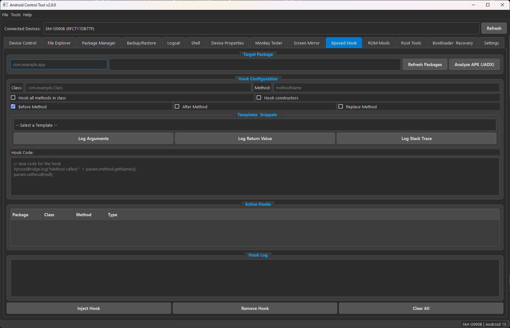
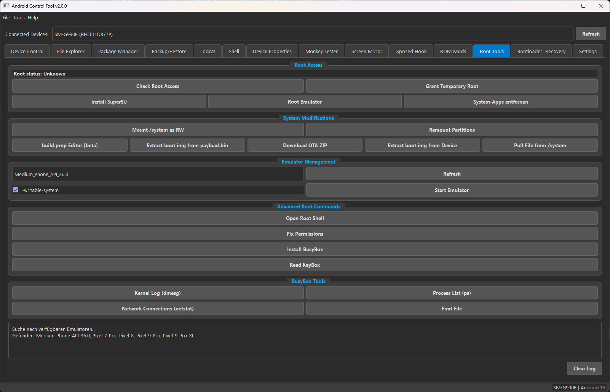

# Android Control Tool V2 (ACT)

A powerful Python GUI tool to manage and control Android devices via ADB and Fastboot.

## MEGA UPDATE AVAILABLE V2.0.0

Android Control Tool v2.0.0 - Release Notes
This is a massive update, moving from v1.0.1 to v2.0.0, representing a near-complete rewrite of the application's backend and a significant expansion of its feature set. The focus has been on improving stability, performance, and adding powerful new tools for developers and power users.

✨ New Features
Major New Tools & Tabs
Screen Mirroring: A new "Screen Mirror" tab integrates scrcpy to provide high-performance, low-latency screen mirroring. The tool can automatically download and set up scrcpy if it's not found.
Advanced Shell: A dedicated "Shell" tab provides an interactive ADB shell experience with command history and a list of pre-defined "Quick Commands" for common tasks like checking battery, memory, and processes.
Device Properties Explorer: The new "Device Properties" tab fetches all system properties (getprop) and displays them in a categorized, searchable, and exportable tree view.
Monkey Tester: A "Monkey Tester" tab has been added, providing a user-friendly interface for running adb shell monkey stress tests on your applications.
ROM Modifications: For rooted users, the "ROM Mods" tab offers a suite of common system modifications, including:
Applying custom boot animations and fonts.
Changing screen DPI.
Applying an ad-blocking hosts file.
Toggling SELinux modes and the on-screen navigation bar.
Setting private DNS and adjusting animation scales.
Bootloader & Recovery: A consolidated "Bootloader & Recovery" tab replaces the separate Fastboot and Recovery tabs, offering a more streamlined workflow for flashing, wiping, and managing your device in these modes. It now includes a dedicated section for flashing Magisk-patched boot images.
Minor Feature Additions
Screen Recording: The "Device Control" tab now includes a robust screen recording feature with options for resolution, bitrate, and time limits.
Clipboard Management: Easily get and set the device's clipboard content directly from the "Device Control" tab.
Text Input: A new input field allows you to type and send text directly to the focused field on your device.
APK Analysis: Before installing an APK, the tool now uses aapt to display detailed information, including permissions, version, and app name.
Automatic Tool Setup: The settings tab now includes options to automatically download and configure the Android SDK Platform-Tools (adb, fastboot) and other dependencies like scrcpy.
🚀 Improvements & Refactoring
Core Architecture: The application's backend has been completely refactored. It now uses QProcess and a non-blocking command queue instead of Python's subprocess, resulting in a more responsive, stable, and crash-free UI.
Device Detection: Device scanning is now fully asynchronous, eliminating UI freezes when devices are connected or disconnected. The device list updates more efficiently and displays the device model name for easier identification.
Error Handling & Logging:
A global exception handler has been implemented to catch and log any unhandled errors, preventing unexpected crashes.
All application events and errors are now logged to android_control_tool.log in the user's AppData directory.
Error messages in dialog boxes are now selectable, allowing users to easily copy them for bug reports.
Package Manager:
Package information is now much more detailed, showing target SDK, installer, signature, and more.
Long-running operations (installing, uninstalling) now display a progress dialog and run in the background without freezing the app.
File Explorer:
Added drag-and-drop support for pushing files (from local to remote) and pulling files (from remote to local).
Added a file preview dock that can show thumbnails for images and content for text files on both the local and remote file systems.
Added context menu options for renaming files and calculating folder sizes.
Root Tools:
Emulator rooting is now more robust, with a guided process that handles the required device reboots.
Added functionality to automatically download and install necessary tools for rooting and ROM modification, such as payload-dumper-go.
🎨 UI/UX Enhancements
Modern Theme: The application now features a modern, dark theme for improved readability and aesthetics.
Icons & Tooltips: Icons have been added to many buttons, and extensive tooltips have been implemented across the application to guide users and explain what each function does.
Improved Layouts: Many tabs have been reorganized for a more logical and intuitive workflow.
Copyable Messages: All informational and error message boxes now allow text selection for easy copying.


## 🧩 Features

- Device detection (ADB / Fastboot)
- Reboot options (System, Recovery, Bootloader, Download)
- File Explorer (local ↔ device)
- APK installation and app management
- Logcat viewer
- Root Management
- Backup and restore
- ADB over WiFi
- Flash via Fastboot
- Install zip via Sideload
- Root Tools/Management
- Build.prop Viewer/Editor (need to update)

## 📸 Screenshot





## 🖼️ Built with

- PyQt6

## 🧪 Supported Android Versions

Android 4.0 to 16+

## 🚀 Installation

1. Make sure `adb` and `fastboot` are available in your system PATH.
2. Install Python 3.11 (3.9+)
3. Install dependencies:

```bash
pip install -r requirements.txt
```

4. Run UACT:

```bash
python main.py
```
# # Knowing Bugs: 
- When tool starts, you get 2 incorrect error messages that the device is not recognized.
Ignore and Press 2x OK! It will be fixed in next Update!

- Build.prop viewer maybe not work with all devices

## 📦 Requirements

```
PyQt6
requests
packaging
```

## 👤 Developer

**fzer0x**

## ⚠️ Note

This tool interacts directly with your Android device (Wifi/USB). USB debugging must be enabled and the ADB connection authorized on the device.

## 📜 License

[MIT License](LICENSE) – Free to use, modify, and distribute with conditions.
